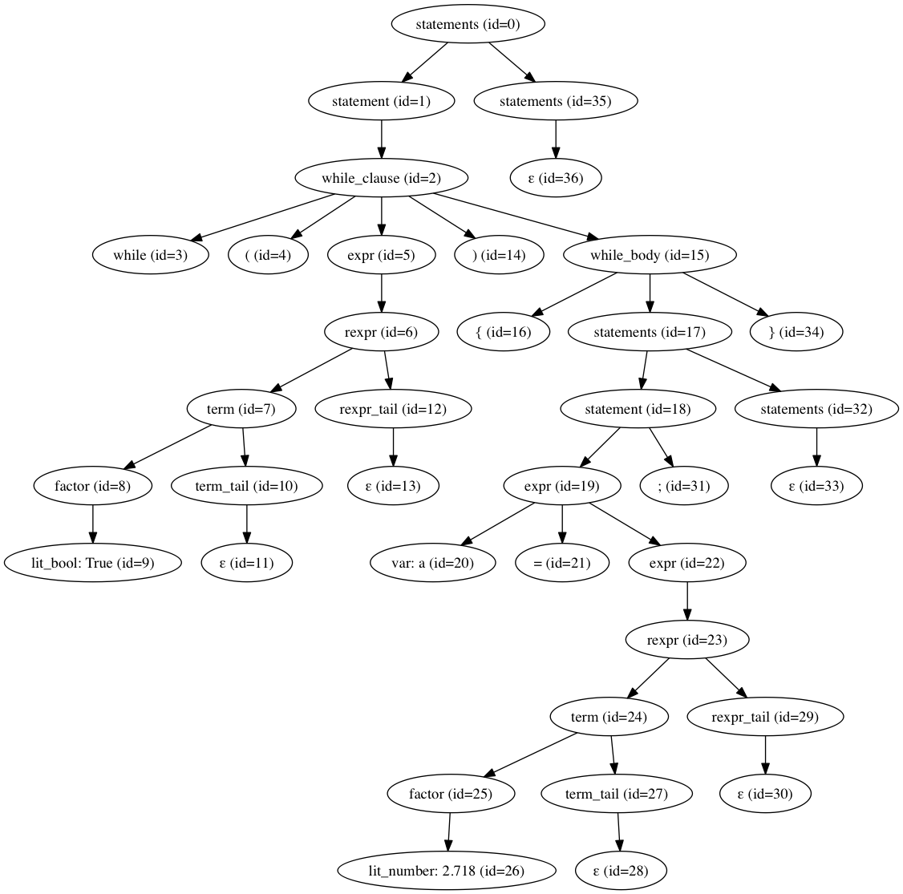

## 程序设计语言概论 作业二

*张孝帅 1500010716*

*jet@pku.edu.cn*


### 一、概述

本次语法分析器使用 python 语言实现，分析的语言为 C 语言的一个子集，包括基本的包含 `+`、`-`、`*`、`/` 的表达式，赋值语句（要求等号全出现在左边），`while` 语句等。词法分析器按 C 语言规范进行合法变量名检查，并支持整数、浮点数、布尔值等三种字面量。


### 二、词法分析

#### 算法描述

由于该子集支持的运算符均为单字符运算符，词法分析较为简单，只需每次向前看一个字符即可，具体过程可描述为：

1. 去除所有空白字符（` `, `\n`, `\t` 等），创建字符缓存
2. 提取下一字符，判断是否为分隔符 (delim) 之一
   - 是：分析当前字符缓存中的内容，判断是否是合法的字面量、关键字或标识符之一：
     - 是：创建对应符号 (token) 并加入输出队列，清空字符缓存
     - 否：报错并退出词法分析
   - 否：将该字符加入字符缓存
3. 重复步骤二，直到 `EOF` ，检查字符缓存中的剩余字符

其中合法的分隔符 (delim) 包括 `{}();+-*/=` ，合法的关键字 (keyword) 包括 `while`、`true`、`false`。 

该部分的实现主体为 `lexeme.py` 中的 `tokenizer` 函数。

#### 错误处理

由于词法规则简单，词法分析器唯一可能的错误为：

- 提取到分隔符时，当前字符缓存中的字符串不是合法字面量、关键字或标识符

此时将在标准错误流输出具体错误信息，并返回 `False` ：

```python
# Is this a keyword?
if __parse_keyword(s):
    ...

# Is this literal (number) ?
if __is_number(s):
    ...

# Then this should be a variable (identifier)
if not re.match(r"[a-zA-Z_][0-9a-zA-Z_]*", s):
    print("lx: Invalid identifier: ", s, file=sys.stderr)
    return False, None
```

其中正则表达式 `r"[a-zA-Z_][0-9a-zA-Z_]*"` 描述了所有合法的 C 语言标识符（此处直接用 `re` 比自己实现优雅）。


### 三、语法分析

#### 文法描述

经过简化和消除左递归等步骤该语言的语法规则为：

起始符号：`statements`

```
statements    ->   statement statements	
              |    \ε
statement     ->   while_clause
              |    expr;
              |    ;

while_clause  ->   \while \( expr \) while_body
while_body    ->   statement
              |    \{ statements \}

expr          ->   \var \= expr
              |    rexpr
rexpr         ->   term rexpr_tail
rexpr_tail    ->   \+ term rexpr_tail
              |    \- term rexpr_tail
              |    \ε
term          ->   factor term_tail
term_tail     ->   \* factor term_tail
              |    \/ factor term_tail
              |    \ε
factor        ->   \( rexpr \)
              |    \lit
              |    \var
```

其中 `\XXX` 代表终结符号， `\ε` 代表空子串， `\lit` 代表字面符号， `\var` 代表变量符号， `\while` 代表 `while` 关键字。

该部分的主要代码实现为 `grammar.py` 中的 `check_grammar` 函数，该函数大部分时候只要向前看一个符号，只有一种需要回溯的情况（第一条规则，实际可以避免）。

#### 错误处理

经过修改，该语法分析器可以提示以下几种错误：

1. 检测到 `while` 语句，但缺少 `(` 、`)` 或表达式不合法：

   ```c
   while ( expr )
         ^   ^  ^
   ```


1. 右大括号不匹配：

   ```c
   while ( expr ) { statements }
                               ^
   ```

2. 监测到 `statement` ，但缺少 `;` ：

   ```c
   statement;
            ^
   ```

3. 右括号不匹配：

   ```c
   ( rexpr )
           ^
   ```


1. 缺少合法右值表达式：

   ```c
   a + rexpr;
         ^
   ```

2. 非法文件尾：即 `statements` 下降至底后，符号队列仍不为空（大多数时候与错误3或5同时发生）

以上错误均会将具体错误信息打印至标准错误流，并设置错误标记，退出语法分析。


### 四、实验

实验使用的解释器为 `python3.6.1` 。同时，为了方便打印语法树并可视化，我们使用了 `anytree` 库进行树操作，并用 `matplotlib` 打开图片，测试时可能需要额外安装所需模块。

#### 词法分析实验

以下列输入为例（`./test_samples/simple_test_2.c`）：

```c
a = b = 1;

while (a) {
    while (a) while (b) ;;
    c = 1.0;
}
```

词法分析器分析结果：

```bash
Reading from ./test_samples/simple_test_2.c:
lx: Lexemes parse successfully
[('var', 'a'), ('oprtr_eq', '='), ('var', 'b'), ('oprtr_eq', '='), ('lit_number', 1), ('delim_semicolon', ';'), ('key_while', 'while'), ('delim_left_paren', '('), ('var', 'a'), ('delim_right_paren', ')'), ('delim_left_brace', '{'), ('key_while', 'while'), ('delim_left_paren', '('), ('var', 'a'), ('delim_right_paren', ')'), ('key_while', 'while'), ('delim_left_paren', '('), ('var', 'b'), ('delim_right_paren', ')'), ('delim_semicolon', ';'), ('delim_semicolon', ';'), ('var', 'c'), ('oprtr_eq', '='), ('lit_number', 1.0), ('delim_semicolon', ';'), ('delim_right_brace', '}')]
```

可以成功分析，并返回词素符号序列。

一个错误输入样例：

```c
a = 2b;
```

词法分析器结果：

```bash
Reading (one) line from stdin:
a = 2b; 
lx: Invalid identifier:  2b
lx: Lexemes parse failed
```

可以看到准确的错误提示。

#### 语法分析实验

以下列输入为例（`./test_samples/simple_test_3.c`）：

```c
while (true) {
    a = 2.718;
}
```

程序能够成功分析，并打印出语法树：

```
gr: Syntactic analysis successfully
statements
├── statement
│   └── while_clause
│       ├── while
│       ├── (
│       ├── expr
│       │   └── rexpr
│       │       ├── term
│       │       │   ├── factor
│       │       │   │   └── lit_bool: True
│       │       │   └── term_tail
│       │       │       └── ε
│       │       └── rexpr_tail
│       │           └── ε
│       ├── )
│       └── while_body
│           ├── {
│           ├── statements
│           │   ├── statement
│           │   │   ├── expr
│           │   │   │   ├── var: a
│           │   │   │   ├── =
│           │   │   │   └── expr
│           │   │   │       └── rexpr
│           │   │   │           ├── term
│           │   │   │           │   ├── factor
│           │   │   │           │   │   └── lit_number: 2.718
│           │   │   │           │   └── term_tail
│           │   │   │           │       └── ε
│           │   │   │           └── rexpr_tail
│           │   │   │               └── ε
│           │   │   └── ;
│           │   └── statements
│           │       └── ε
│           └── }
└── statements
    └── ε

```

并给出图片输出：



若给出错误输入，例如：

```bash
a + b

gr: Expect ';' after lexeme b
gr: Syntactic analysis failed
```

```bash
while (true {}

gr: Expect ')' after lexeme True
gr: Syntactic analysis failed
```

```bash
a+;

gr: Expect valid r-expressions after +
gr: Syntactic analysis failed
```

可以看到，该词法分析器达到了比较高的实用性。


### 五、总结与展望

通过这次简易语言词法、语法分析器的实验，我加深了对编译器工作原理的认识，并提升了相关的编程能力。这次实现的简易语言仍有许多不足，如：

- 没有实现任何一个比较运算符，
- 赋值运算没有作为一般运算来处理，
- 仅支持了 `while` 语句，没有实现 `if` 语句，
- 错误提示仍有很多情况没有覆盖，提示定位不够精确

在之后的时间里，我会试着继续完善这个简易分析器。


#### 代码使用说明

1. 要求使用 `python3` 解释器解释执行，并安装 `anytree` 、 `matplotlib` 等模块；

2. 测试入口位于 `./code/test.py` ，测试方法：

   1. 从命令行标准输入读入测试字符串（单行）：

      不带参数执行 `python3 ./test.py` 即可

   2. 从文件读入测试字符串（支持多行）：

      `python3 ./test.py 输入文件路径 输出图片路径`

      如：

      `python3 ./test.py ./test_samples/simple_test_3.c ./test_samples/simple_test_3.png`

3. 若无法安装第三方模块，可使用 `./code/deprecated/test.py` 中的未维护版本进行测试，该版本包括一个手写的语法树类以及相关打印函数，但不包含从文件读入、输出图片、错误提示等功能，使用方法：

   `python ./test.py`

